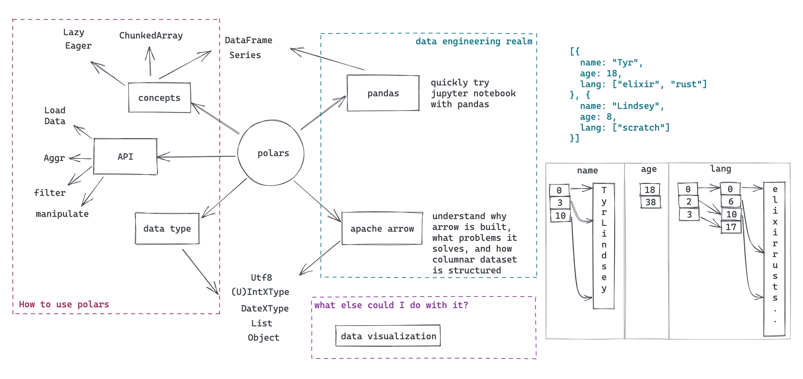
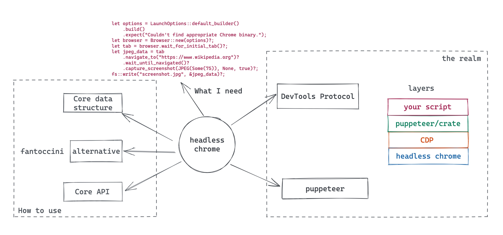

# 如何快速掌握新的 crates？

- [快速掌握新 crates 的方法](#2)
- [Rust 值得关注的 crates](#8)
- [Live coding](#15)

---

## 快速掌握新 crates 的方法

---

### 如何判断一个 crate 的质量？

- crates.io 下载量 / dependents 数量 / github star
- 更新频率
- 其 dependency 的质量（是否较新）
  - 比如 crate 还依赖 futures < 0.3 / tokio < 1 不值得尝试
- README / docs.rs / 测试 / 示例代码 / 源代码

---

### 快速尝试 crates 的方法

- 快速阅读文档
- 了解相关的知识（包括 ecosystem）
- clone repo
- 尝试 example（并用自己的方式实现某些 example）
- 阅读源码

---

### 示例：polars

---

### 示例：headless_chrome

---

### 比较 polars 和 headless_chrome

- 大概代表了我们会使用的 crates 的两级
- 代码量：polars（50k vs 8k）
- 学习曲线：polars（背景知识多）
- 文档质量：都一般
- 容易上手：headless_chrome

---

### Rust 生态中值得关注的 crates

##### 极简版，且不包含 are we xxx yet 页面提及的 crates

---

### FFI 相关

- C++: [autocxx](https://github.com/google/autocxx)
- Elixir: [Rustler](https://github.com/rusterlium/rustler)
- Python: [PyO3](https://github.com/PyO3/pyo3)
- Nodejs: [neon](https://github.com/neon-bindings/neon)
- Swift: [cbingen](https://github.com/eqrion/cbindgen)
- Java: [jni-rs](https://github.com/jni-rs/jni-rs), [flapigen-rs](https://github.com/Dushistov/flapigen-rs), [robusta](https://github.com/giovanniberti/robusta)

---

### macro 相关

- [derive_more](https://github.com/JelteF/derive_more)
- [syn](https://github.com/dtolnay/syn)
- [quote](https://github.com/dtolnay/quote)
- [cargo-expand](https://github.com/dtolnay/cargo-expand)
- [proc-macro-workshop](https://github.com/dtolnay/proc-macro-workshop)
- [seq-macro](https://github.com/dtolnay/seq-macro)
- [paste](https://github.com/dtolnay/paste)

---

### 并发处理

- [parking_lot](https://github.com/Amanieu/parking_lot)
- [crossbeam](https://github.com/crossbeam-rs/crossbeam)
- [dashmap](https://github.com/xacrimon/dashmap)
- [flume](https://github.com/zesterer/flume)
- [rayon](https://github.com/rayon-rs/rayon)
- [rxRust](https://github.com/rxRust/rxRust)

---

### parser

- [nom](https://github.com/Geal/nom)
- [pest](https://github.com/pest-parser/pest)
- [pom](https://github.com/J-F-Liu/pom)

---

### 日志，追踪

- [tracing](https://github.com/tokio-rs/tracing)

---

### 其它

- [bytes](https://github.com/tokio-rs/bytes)
- [serde](https://github.com/serde-rs/serde)
- [itertools](https://github.com/rust-itertools/itertools)
- [oso](https://github.com/osohq/oso)
- [time](https://github.com/time-rs/time)
- [tauri](https://github.com/tauri-apps/tauri)

---

### Live coding：构建一个命令行工具

- 工具：clap，rust-headless-chrome，qrcode-rust
- 思路：
  - clap 提供基本命令行 `web2png <url> --with-qr-code`
  - 使用 headless_chrome 抓取 url，存储为图片
  - 使用 qrcode-rust 对 URL 生成 QR code，添加到图片中

---

### Live coding（有时间的话）：TBD

---

### 参考资料

- [polars](https://github.com/pola-rs/polars)
- [headless_chrome](https://github.com/atroche/rust-headless-chrome)
- [fantoccini](https://github.com/jonhoo/fantoccini)
- [qrcode-rust](https://github.com/kennytm/qrcode-rust)
- [clap](https://github.com/clap-rs/clap)
