<style>
.row {
  display: flex;
  flex-direction: row;
  flex-wrap: wrap;
  width: 100%;
}

.column {
  display: flex;
  flex-direction: column;
  flex-basis: 100%;
  flex: 1;
}
</style>

# 程序君的 Rust 培训课

<style scoped>
    ul { columns: 2; width: 90%; }
</style>

- [Rust 初体验](#2)
- [所有权，借用检查，以及生命周期](#38)
- [类型系统和泛型编程](#62)
- [并发 - 原语](#83)
- [并发 - async/await](#113)

---

## 培训中用到的工具

- [Rust 1.52 (Rustup 安装)](https://rustup.rs/)
- [Rust search extension](https://rust.extension.sh/)
- VSCode + rust analyzer
- [Excalidraw](https://excalidraw.com/)

---

<!-- _backgroundColor: #264653 -->
<!-- _color: #e1e1e1 -->

## Rust 初体验

---

<!-- _backgroundColor: #000 -->


---

## 为什么要有 Rust？

###### Rust 解决什么问题？给我们带来什么好处？

---

### 我们看看编程语言的 trade off

<style scoped>
    ul { columns: 3; width: 90%; }
</style>

- Approachability
- Availability
- Compatibility
- Composability
- Debuggability
- Expressiveness
- Extensibility
- Interoperability
- Integrity
- Maintainability
- Measurability
- Operability
- Performance
- Portability
- Productivity
- Resilliency
- Rigor
- Safety
- Security
- Simplicity
- Stability
- Thoroughness
- Transparent
- Velocity

---

## C

<style scoped>
    ul { columns: 3; width: 90%; color: #ddd; }
</style>

- Approachability
- Availability
- Compatibility
- Composability
- Debuggability
- Expressiveness
- Extensibility
- Interoperability
- Integrity
- Maintainability
- Measurability
- Operability
- _Performance_
- Portability
- Productivity
- Resilliency
- Rigor
- Safety
- Security
- _Simplicity_
- Stability
- Thoroughness
- _Transparent_
- Velocity
---

## Erlang/Elixir

<style scoped>
    ul { columns: 3; width: 90%; color: #ddd; }
</style>

- Approachability
- Availability
- Compatibility
- Composability
- Debuggability
- Expressiveness
- Extensibility
- Interoperability
- Integrity
- Maintainability
- Measurability
- Operability
- Performance
- Portability
- __Productivity__
- _Resilliency_
- Rigor
- _Safety_
- Security
- _Simplicity_
- Stability
- Thoroughness
- Transparent
- Velocity

---

## Python

<style scoped>
    ul { columns: 3; width: 90%; color: #ddd; }
</style>

- _Approachability_
- Availability
- Compatibility
- Composability
- Debuggability
- _Expressiveness_
- Extensibility
- Interoperability
- Integrity
- Maintainability
- Measurability
- Operability
- Performance
- Portability
- _Productivity_
- Resilliency
- Rigor
- Safety
- Security
- _Simplicity_
- Stability
- Thoroughness
- Transparent
- Velocity

---

## Java (in early days)

<style scoped>
    ul { columns: 3; width: 90%; color: #ddd; }
</style>

- Approachability
- Availability
- Compatibility
- Composability
- Debuggability
- Expressiveness
- Extensibility
- Interoperability
- Integrity
- Maintainability
- Measurability
- Operability
- _Performance_
- _Portability_
- Productivity
- Resilliency
- Rigor
- _Safety (memory)_
- _Security_
- Simplicity
- Stability
- Thoroughness
- Transparent
- Velocity

---

## Rust


<style scoped>
    ul { columns: 3; width: 90%; color: #ddd; }
</style>

- Approachability
- Availability
- Compatibility
- Composability
- Debuggability
- _Expressiveness_
- Extensibility
- Interoperability
- Integrity
- Maintainability
- Measurability
- Operability
- _Performance_
- Portability
- _Productivity_
- Resilliency
- Rigor
- _Safety!!!_
- Security
- Simplicity
- Stability
- Thoroughness
- Transparent
- Velocity

---


---

## 为什么语言安全性如此重要?

---

<!-- _backgroundColor: #f8f8f8 -->

<style scoped>
h6 {font-size: 16px;}
</style>


###### (来源: [Memory Safety Issues Are Still the Leading Source of Security Vulnerabilities](https://blogs.grammatech.com/memory-safety-issues-are-still-the-leading-source-of-security-vulnerabilities))

---

## 在编程语言级别达到安全性很困难！

- 内存安全并不容易（有很多 corner case）
- 并发安全非常困难（除非做很多妥协）
- 额外的抽象层级（意味着大量性能损失）

---

## 如何实现内存安全？

- 人工管理 - C/C++，很痛苦，容易出错
- 智能指针 - C++/ObjC/Swift：性能损失，循环引用问题
- GC - Java/DotNet/Erlang：大量的内存消耗，不必要的堆内存分配，以及（潜在的）STW
- Ownership - Rust：范式转换（paradigm shift），学习曲线

---

## 如何实现并发安全？

- 单线程 - javascript
  - 最安全的并发是单线程并发
  - 无法有效利用多核
- GIL - Python/Ruby
  - 一把大锁牺牲性能，换来安全
  - 锁粒度太大
- Actor model - Erlang/Akka
  - 通过消息同步（actor -> actor）
  - 额外内存拷贝和堆内存分配
- CSP - Golang
  - 通过消息同步（coroutine -> channel -> coroutine）
  - 额外内存拷贝和堆内存分配
- Ownership + Type System - Rust
  - 用类型安全来保证并发安全
  - 优雅，无性能损失，且和其它方案无缝兼容

<style scoped>
    section > ul { columns: 2; width: 80%; }
</style>

---

### Rust 如何实现 _内存安全_ 和 _并发安全_？

###### 并且不引入 __额外开销__？

---

### 我们从最基本的语法单元 — _值_ 说起

##### Live coding

---


---

## 更多代码示例

---

<!-- _backgroundColor: #1e1e1e -->
<!-- _color: #e1e1e1 -->


---

<!-- _backgroundColor: #1e1e1e -->
<!-- _color: #e1e1e1 -->


---


## 回顾

<style scoped>
h5 {font-size: 20px; margin-top: 0px;}
h6 {font-size: 18px; margin-top: 40px;}
</style>

- 在一个 scope 中
  - 一个值只有一个所有者
  - 但可以有多个不可变引用
  - 以及唯一的可变引用（mutual exclusive）
  - 引用的生命周期不能超过值的生命周期
- 在多线程环境下
  - 类型安全（`Send` / `Sync`）保证并发安全

###### 使用这些简单的规则，Rust 实现了 _零成本抽象_ 的安全

---

### 类型系统


---

### 错误处理

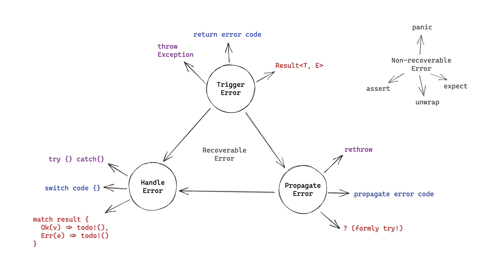

---

### Live coding: 用文件持久化数据结构

###### 思考：如何在内存和 IO 设备间交换数据？

---

### Rust 开发的效率如何?

---

<!-- _backgroundColor: #1e1e1e -->
<!-- _color: #e1e1e1 -->

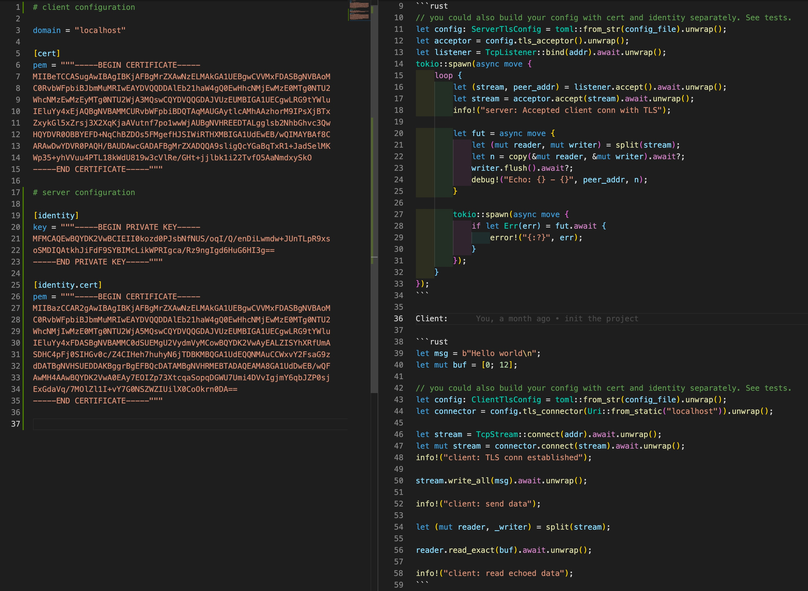

---

### Rust 可以用来做什么？


---

### Rust 和其它语言的互操作


---

### 我是个 xyz 程序员，学 Rust 该注意什么？

- Erlang/Elixir: 所有权，类型系统，可变性
- Java/Swift/Scala: 所有权
- Typescript: 所有权，多线程编程
- Python: 所有权，类型系统，并发处理

---

### 学习 Rust 的误区...

---

### 1. Rust 非常难学？


---

### 非也，Rust 就是想跟你处得明明白白

- 范式转移（Paradigm Shift）
- 大量计算机体系结构操作系统相关的知识一下子扑鼻而来
- 如果学习一门语言的痛苦是 100%：
  - Rust：
    - 编译器帮你降低了 10% 的痛苦
    - 然而你需要在头 3-6 个月承受剩下 70% 的痛苦
    - 在接下来 3-5 年承受最后 20% 的痛苦
  - 其它语言：
    - 头 3-6 个月，你只需要承受 10-30% 的痛苦
    - 之后的 3-5 年你可以慢慢承受 70-90% 的痛苦

---

### 2. Unsafe Rust 听上去好可怕！

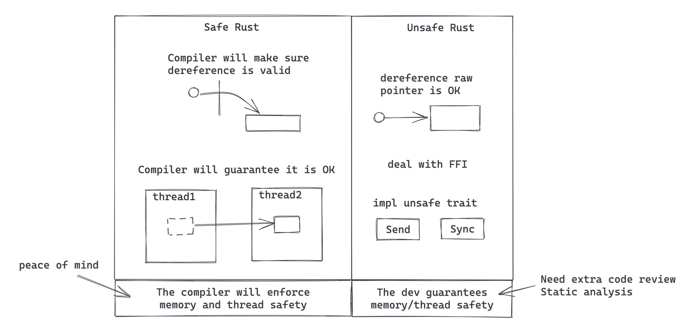

---

<style scoped>
    ul { columns: 2; width: 90%; color: #ddd; }
</style>

## 参考资料

- [The pain of real linear types in Rust](https://gankra.github.io/blah/linear-rust/)
- [Substructural type system](https://en.wikipedia.org/wiki/Substructural_type_system)
- [Rust official book](https://doc.rust-lang.org/book/)
- [Rust official site](https://www.rust-lang.org/)
- [Awesome Rust](https://github.com/rust-unofficial/awesome-rust)
- [Are we web yet?](https://www.arewewebyet.org/)
- [Are we async yet?](https://areweasyncyet.rs/)
- [Are we gui yet?](https://www.areweguiyet.com/)
- [Are we learning yet?](http://www.arewelearningyet.com/)
- [Are we game yet?](https://arewegameyet.rs/)
- [Are we quantum yet?](https://arewequantumyet.github.io/)
- [Are we IDE yet?](https://areweideyet.com/)
- [Rust is for Professionals](https://gregoryszorc.com/blog/2021/04/13/rust-is-for-professionals/)

---

<!-- _backgroundColor: #264653 -->
<!-- _color: #e1e1e1 -->

## 所有权，借用检查，以及生命周期

---

### 再探所有权和借用检查


---

## 生命周期（Lifetime）并非新概念

---

#### 栈内存的生命周期管理

```c
#include <stdio.h>
static int VALUE = 42;

void world(char *st, int num) {
    printf("%s(%d)\n", st, num);
}


void hello(int num) {
    char *st = "hello world";
    int v = VALUE+num;
    world(st, v);
}

int main() {
    hello(2);
}

```


---

### 堆内存的生命周期管理

###### 手工管理，GC，ARC，...

---

#### Tracing GC


---

#### ARC


---

## Rust 如何打破常规？

###### Rust 并非独创，它继承了 C++ 和 Cyclone 的很多研究

---

### Move 语义：保证有且只有一个 owner

---

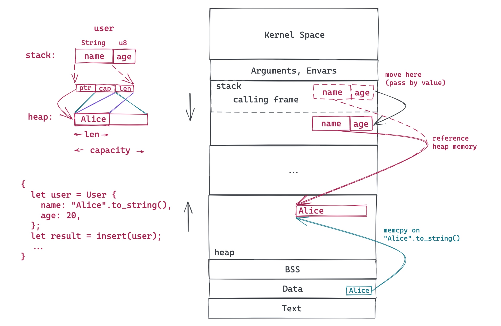


---

### Borrow 语义：共享下的线程安全

###### 思考题：为什么同样使用了引用，在 Rust 可以保证线程安全，而 C++ 不行？

---


---

#### Rust 生命周期检查器如何避免有问题的引用？

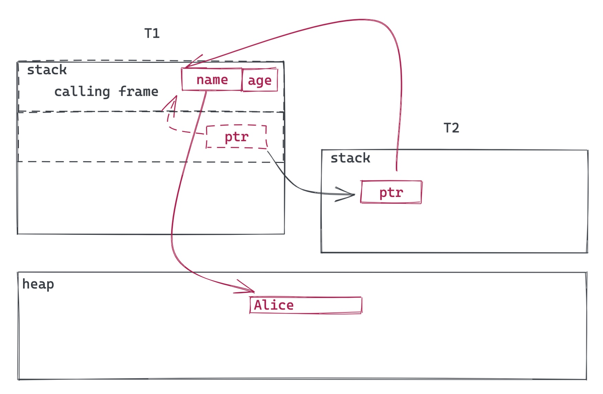

---

### 带生命周期限制的借用

- 可以借用任何值（栈内存，堆内存）
- 编译期检查（不需要耗费运行期的 CPU）
- Rust 借用检查器基本上是个生命周期检查器

---

### 我们如何告诉编译器生命周期？

- 类似泛型，但有其专用符号 `'`
- 只有生命周期无法被推断出来，才需要声明

```rust
// need explicit lifetime
struct User<'a> {
    name: &'a str,
    ...
}
fn process<T, 'a, 'b>(item1: &'a T, item2: &'b T) {}

// &'a User could be written as &User since on confliction
fn lifetime_example(user: &User) { // --+ Lifetime 'a
    if user.is_authed() {          //   |--+ Lifetime 'b
        let role = user.roles();   //   |  |
                                   //   |  |--+ Lifetime 'c
        verify(&role);             //   |  |  |
                                   //   |  |--+
    }                              //   |--+
}                                  // --+

fn verify(x: &Role) { /*...*/ }
```

---

### Live coding: strtok

---

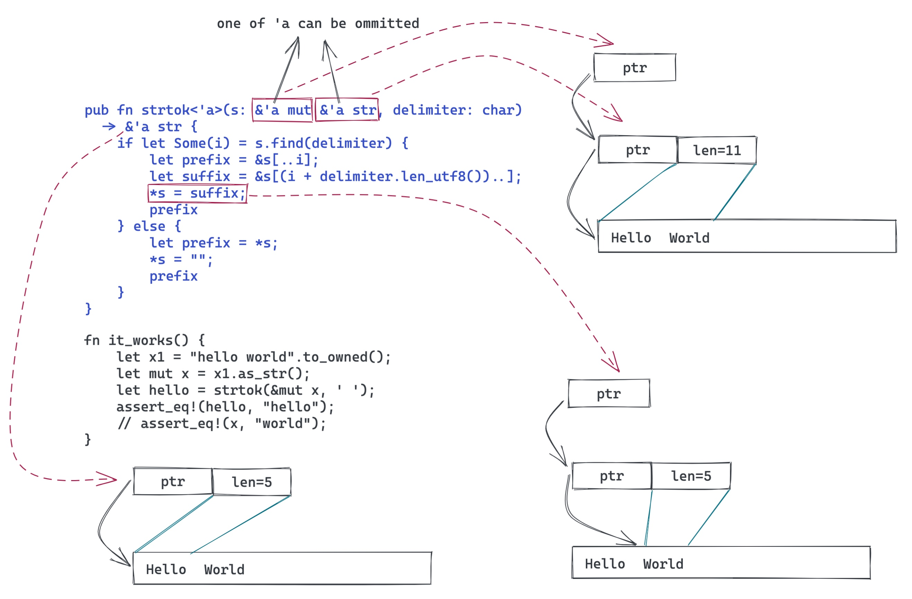

---

### Static Lifetime

- `'static`
- 在 bss / data / text section 中的数据
  - constants / static variables
  - string literals
  - functions
- 如果在类型的 trait bound 中使用:
  - 类型不包含任何非静态的引用（non-static references）
- 有所有权的数据的 lifetime bound 是 `'static`，引用数据不是

---

### 我们再回头看：Thread spawn


```rust
pub fn spawn<F, T>(f: F) -> JoinHandle<T>
where
    F: FnOnce() -> T,
    F: Send + 'static,
    T: Send + 'static,
{
    Builder::new().spawn(f).expect("failed to spawn thread")
}
```

###### 这里 `'static` lifetime bound 是说：`F` 不能使用任何借用的数据

---

### RAII (Resource Acquisition Is Initialization)

- 对象的初始化会保证资源的初始化
- 对象的释放会保证资源的释放

---

### Drop Trait

- memory
- file
- socket
- lock
- any other OS resources

---

### RAII live coding: 博物馆门票

###### 疫情期间，博物馆内限流最大容量 50 人，满了之后，出来一个才能进一个，怎么设计？

---

### 总结：Cost of defects

- 代码中不引入任何缺陷（只要是人，就无法避免错误）
- 在敲入代码的时候就能被清晰地告知代码中的缺陷（发现问题时间：毫秒级）
- 在编译或者单元测试时发现（秒级/分钟级）
- 代码被 push 到 PR 中，CI 发现错误（分钟级/天级）
- 别人 review 你的代码时发现问题（小时级/天级）
- 代码 merge 到 master，更严格的 CI（比如 end-to-end test）发现错误（小时级/天级）
- 代码被部署后回归测试发现问题（天/周/月）
- 代码被部署后很久用户发现问题（周/月/年）

---

### 参考资料

- [Mark-And-Sweep (Garbage Collection Algorithm)](https://www.linkedin.com/pulse/mark-and-sweep-garbage-collection-algorithm-saral-saxena/)
- [Tracing garbage collection](https://en.wikipedia.org/wiki/Tracing_garbage_collection)
- [Swift: Avoiding Memory Leaks by Examples](https://medium.com/hackernoon/swift-avoiding-memory-leaks-by-examples-f901883d96e5)
- [Reference counting](https://en.wikipedia.org/wiki/Reference_counting)
- [Fearless concurrency with Rust](https://blog.rust-lang.org/2015/04/10/Fearless-Concurrency.html)
- [Rust means never having to close a socket](https://blog.skylight.io/rust-means-never-having-to-close-a-socket/)
- [Programming Rust: ownership](https://www.oreilly.com/library/view/programming-rust/9781491927274/ch04.html)
- [Crust of Rust: lifetime annotation (recommended)](https://www.youtube.com/watch?v=rAl-9HwD858)

---

<!-- _backgroundColor: #264653 -->
<!-- _color: #e1e1e1 -->

## 类型系统和泛型编程

---


---

### 数据结构在内存中是如何排布的？

---

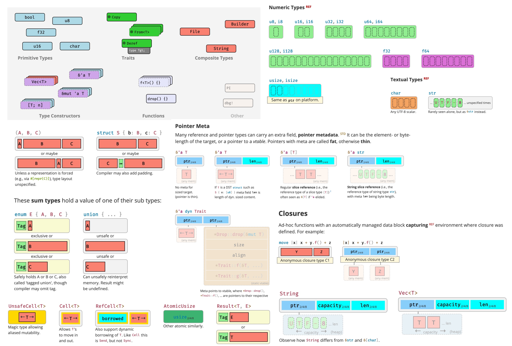

---

### Trait (Typeclass)

---


---

### Live coding：Fibonacci 遍历器

---

### Trait Object

- 你无法直接把值赋给 trait
  - 不像 java，Rust 没有隐式引用
- trait object 是胖指针（自动生成）
  - ptr：指向数据的指针
  - vptr：指向 vtable 的指针
- 动态分发


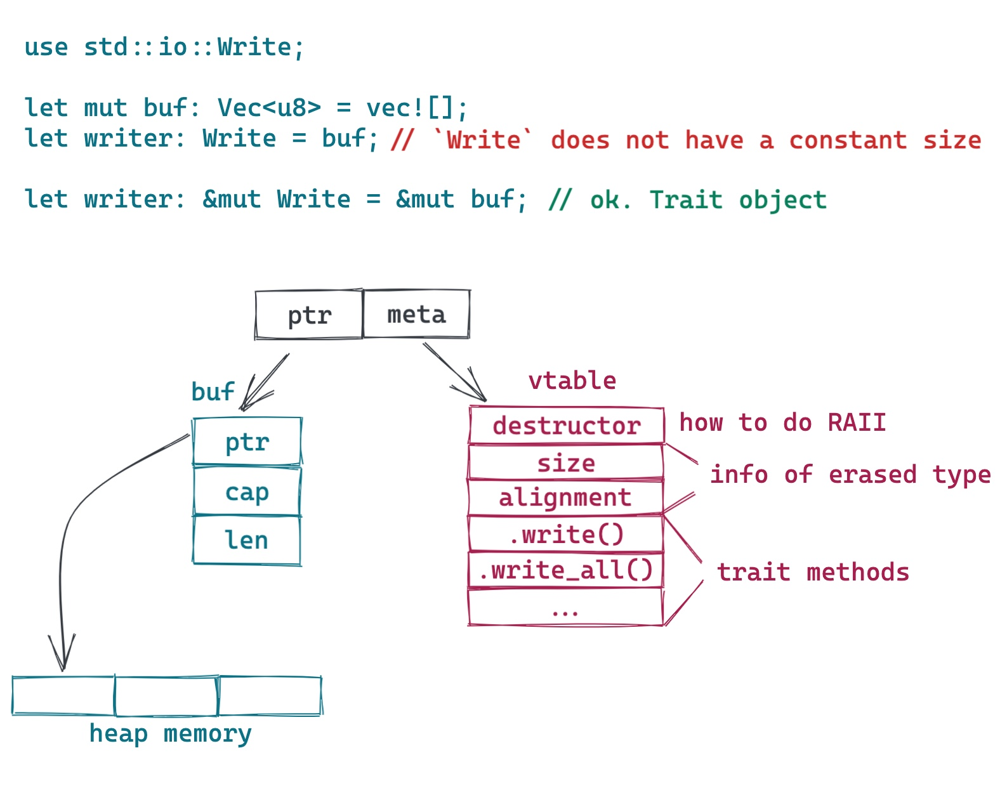

---

<!-- _backgroundColor: #1e1e1e -->
<!-- _color: #e1e1e1 -->


---

#### More about trait

- associated type
- generics
- supertrait
- trait composition

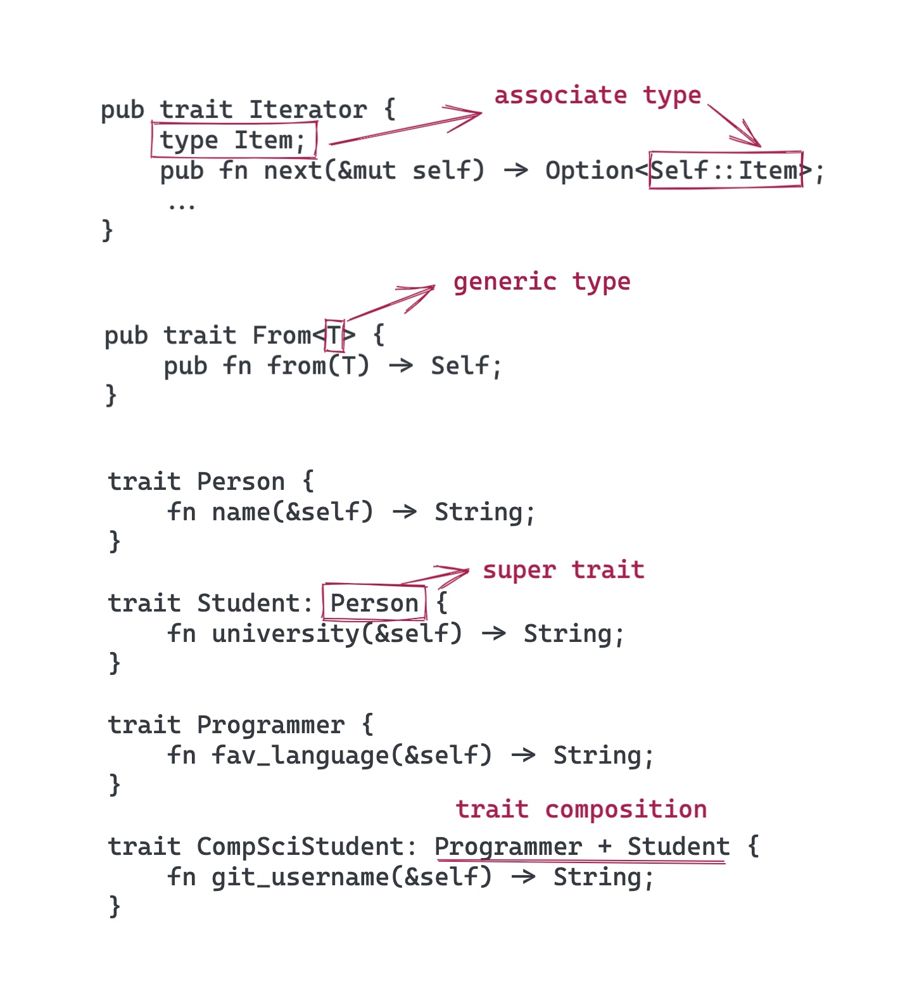

---

## Generics

---

### History of Generic Programming


(from: [Fundamentals of Generic Programming](http://stepanovpapers.com/DeSt98.pdf))

---

### _Generics_ 之于 __Types__

就像
###  _Types_ 之于 __Values__

---

<!-- _backgroundColor: #000 -->


---

<!-- _backgroundColor: #000 -->


---


---

### Generic Programming Example


demo: [rust implmentation](https://github.com/tyrchen/rust-training/blob/master/code/gp/src/lib.rs)

---

### Live coding: Event encoder

---

## Realworld GP example

---


---

> Functions delay binding: data structures induce binding.
> Moral: Structure data late in the programming process.
>
> — Epigrams on programming
---

## 参考文档


- [All about trait objects](https://brson.github.io/rust-anthology/1/all-about-trait-objects.html)
- [Protocol-oriented programming in swift](https://www.youtube.com/watch?v=xE5EcHuz52I&ab_channel=ThuyLuongThi)
- [Generic Data Types](https://doc.rust-lang.org/book/ch10-01-syntax.html)
- [Generics (Rust by Example)](https://doc.rust-lang.org/beta/rust-by-example/generics.html)
- [async prost](https://github.com/tyrchen/async-prost)

---

<!-- _backgroundColor: #264653 -->
<!-- _color: #e1e1e1 -->

## 并发 - 并发原语

---

### 我们来一起构思一个 KV server

---

### v1: 单线程死循环


---

### v2: 多线程，共享数据


---

### v3: 优化锁的粒度


---

### v4: 使用 Channel


---

### v5: 异步处理

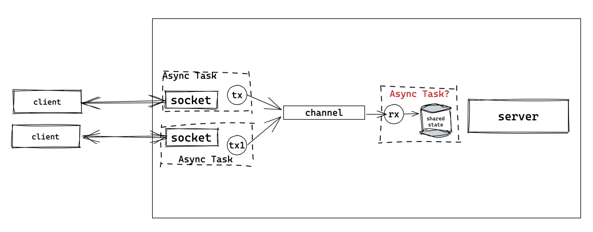

---

### 我们目前使用了什么并发原语？

- Mutex Lock
- Channel/Actor
- Async Task (coroutine, promise, etc.)

---

### Mutex 是如何构建的？

---

### 一个比较糙的实现

```Rust
struct Lock<T> {
  locked: bool,
  data: T,
}

impl<T> Lock<T> {
  pub fn new(data: T) -> Lock<T> { ... }

  pub fn lock<R>(&mut self, op: impl FnOnce(&mut T) -> R) -> R {
    // spin if we can't get lock
    while self.locked != false {} // **1
    // ha, we can lock and do our job
    self.locked = true; // **2
    // execute the op as we got lock
    let ret = op(self.data); // **3
    // unlock
    self.locked = false; // **4
    ret
  }
}

// You may call it like this:
let l = Lock::new(0);
l.lock(|v| v += 1);
```

---

### 问题

- 原子性
  - 在多核环境下，1/2 之间会产生竞争（race condition）- 其它线程也许会进入
  - 在单核环境下，OS 抢占多任务依旧可能会在 1/2 见产生竞争
- 乱序
  - 编译器也许会优化指令，把 3 放在 1 之前
  - CPU 也许会乱序执行（OOO execution），把 3 放在 1 之前

---

### 如何解决这个问题？

- 需要硬件（CPU）来保证原子性和避免 OOO
- 算法：_CAS (Compare-And-Swap)_
- 数据结构（Rust）：`AtomicXXX`

---

## Atomics

---

### 更新之后的 lock

```Rust
struct Lock<T> {
  locked: AtomicBool, // ***
  data: UnsafeCell<T>, // ***
}
unsafe impl<T> Sync for Lock<T> where T: Send {} // need to explicitly impl `Send`

impl<T> Lock<T> {
  pub fn new(data: T) -> Self { ... }
  pub fn lock<R>(&mut self, op: impl FnOnce(&mut T) -> R) -> R {
    // spin if we can't get lock
    while self
      .locked
      .compare_exchange(false, true, Ordering::Acquire, Ordering::Relaxed)
      .is_error() {}
    // execute the op as we got lock
    let ret = op(unsafe { &mut *self.v.get() }); // **3
    // unlock
    self.locked.store(false, Ordering::Release); // **4
    ret
  }
}

// You may call it like this:
let l = Lock::new(0);
l.lock(|v| v += 1);
```

---

### `Ordering` 是什么概念？

- Relaxed: 没有限制，随意 OOO
- Release:
  - 对当前线程，任何 read/write 不能被乱序到这条指令之后（比如：`store`）
  - 对于其它线程，如果用 `Acquire` read，会看到变化后的结果
- Acquire:
  - 对当前线程，任何 read/write 不能被乱序到这条指令之后（比如：`compare_exchange`）
  - 对于其它线程，如果用 `Release` 来更新数据，更新的数据会被当前线程看到
- AcqRel: Acquire 和 Release 的结合
- SeqCst: `AcqRel` 之外，所有线程都看到相同的操作顺序

---

### 继续优化我们的锁

```Rust

pub struct Lock<T> {
    locked: AtomicBool,
    data: UnsafeCell<T>,
}
unsafe impl<T> Sync for Lock<T> where T: Send {}

impl<T> Lock<T> {
  pub fn new(data: T) -> Self {...}
  pub fn lock<R>(&self, op: impl FnOnce(&mut T) -> R) -> R {
      while self
          .locked
          .compare_exchange(false, true, Ordering::Acquire, Ordering::Relaxed)
          .is_err()
      {
          while self.locked.load(Ordering::Relaxed) == true {
              std::thread::yield_now(); // we may yield thread now
          }
      }
      let ret = op(unsafe { &mut *self.data.get() });
      self.locked.store(false, Ordering::Release);
      ret
  }
}
```

---

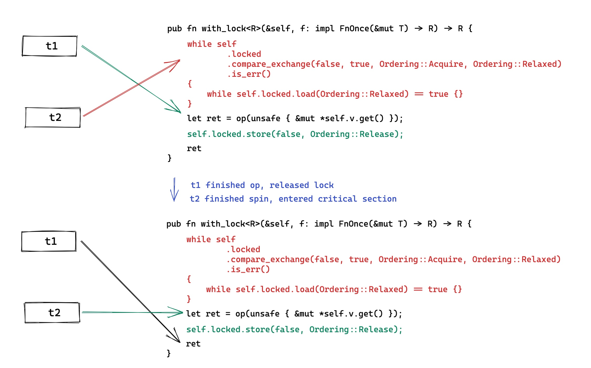

---

### 这是 __Mutex__ 如何运作的基础

---

### Real world Mutex

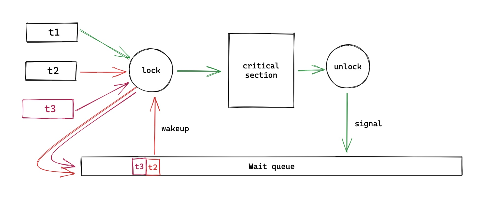

---

## Semaphore

---

> In computer science, a _semaphore_ is a variable or abstract data type used to control access to a common resource by multiple processes and avoid critical section problems in a concurrent system such as a multitasking operating system. A trivial semaphore is a plain variable that is changed (for example, incremented or decremented, or toggled) depending on programmer-defined conditions.
>
> A useful way to think of a semaphore as used in a real-world system is as __a record of how many units of a particular resource are available__, coupled with operations to adjust that record safely (i.e., to avoid race conditions) as units are acquired or become free, and, if necessary, wait until a unit of the resource becomes available.

---

### Semaphore: 更一般化的 Mutex

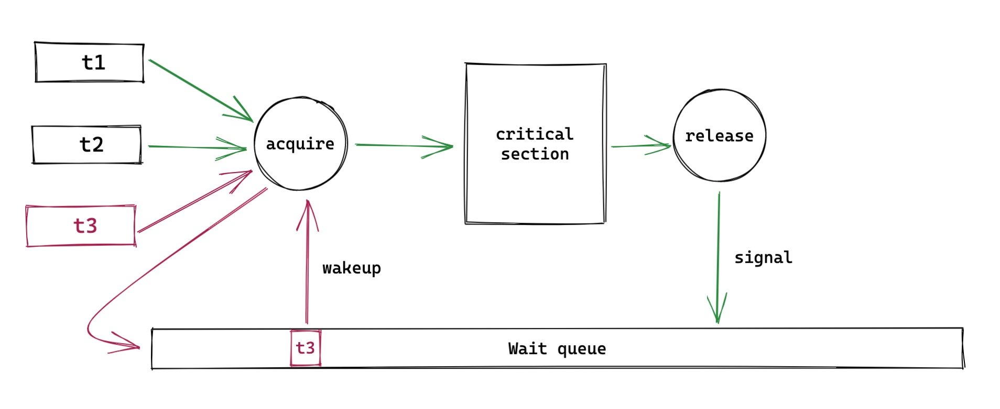

---

### Demo code: restricted HTTP client

[code/primitives/src/http_semaphore.rs](https://github.com/tyrchen/rust-training/blob/master/code/primitives/src/http_semaphore.rs)

---

## Channel

---

### Channel 基础


---

### 各种 Channel 的实现

- sync: 容量有限，发送者会被 block
  - `Mutex` + `Condvar` + `VecDeque`
  - Atomic VecDeque (atomic queue) + `thread::park` + `thread::notify`
- async: 容量无限，发送者不会被 block
  - `Mutex` + `Condvar` + `VecDeque`
  - `Mutex` + `Condvar` + `DoubleLinkedList`
- rendezvous: 容量为 0，用于线程间同步
  - `Mutex` + `Condvar`
- oneshot: 只允许发送一次数据 e.g. Ctrl+C to stop all threads
  - atomic swap
- async/await
  - 和 sync channel 类似，但 `Waker` 不同

---

### Demo code: naive MPSC

[code/primitives/src/channel.rs](https://github.com/tyrchen/rust-training/blob/master/code/primitives/src/channel.rs)

---

### Live coding: naive actor

- ##### 我们用什么 channel 实现 actor？SPSC, SPMC, MPSC？
- ##### 创建 actor 时，`pid` 是什么？
- ##### 给 actor 发送一个 message 后，actor 如何回复给发送者（`handle_call`）？

---

## 参考资料

- CAS: https://en.wikipedia.org/wiki/Compare-and-swap
- Ordering: https://doc.rust-lang.org/std/sync/atomic/enum.Ordering.html
- std::memory_order: https://en.cppreference.com/w/cpp/atomic/memory_order
- Atomics and Memory Ordering: https://www.youtube.com/watch?v=rMGWeSjctlY
- spinlock: https://en.wikipedia.org/wiki/Spinlock
- spin-rs: https://github.com/mvdnes/spin-rs
- parking lot：https://github.com/Amanieu/parking_lot
- Flume: https://github.com/zesterer/flume
- Crossbeam channel：https://docs.rs/crossbeam-channel

---

<!-- _backgroundColor: #264653 -->
<!-- _color: #e1e1e1 -->

## 并发 - async/await

---

### 在 Rust 中使用线程

```rust
use std::thread;

fn main() {
    println!("So we start the program here!");
    let t1 = thread::spawn(move || {
        thread::sleep(std::time::Duration::from_millis(200));
        println!("We create tasks which gets run when they're finished!");
    });

    let t2 = thread::spawn(move || {
        thread::sleep(std::time::Duration::from_millis(100));
        println!("We can even chain callbacks...");
        let t3 = thread::spawn(move || {
            thread::sleep(std::time::Duration::from_millis(50));
            println!("...like this!");
        });
        t3.join().unwrap();
    });
    println!("While our tasks are executing we can do other stuff here.");

    t1.join().unwrap();
    t2.join().unwrap();
}

```

---

### 线程的缺点

- 调用栈太大（不适合大量高并发任务 - 如 web server）
- 上下文切换不受控制
- 上下文切换效率不高（尤其大量线程的环境）

---

### 有什么替代方案？

---

## Green threads/processes

### (stackful coroutine)

#### Golang/Erlang

---

### Green Threads

- Run some non-blocking code.
- Make a blocking call to some external resource.
- CPU "jumps" to the "main" thread which schedules a different thread to run and "jumps" to that stack.
- Run some non-blocking code on the new thread until a new blocking call or the task is finished.
- CPU "jumps" back to the "main" thread, schedules a new thread which is ready to make progress, and "jumps" to that thread.

---

### Green Threads - pros/cons

- Pros:
  - Simple to use. The code will look like it does when using OS threads.
  - A "context switch" is reasonably fast.
  - Each stack only gets a little memory to start with so you can have hundreds of thousands of green threads running.
  - It's easy to incorporate preemption which puts a lot of control in the hands of the runtime implementors.
- Cons:
  - The stacks might need to grow. Solving this is not easy and will have a cost.
  - You need to save the CPU state on every switch.
  - It's not a zero cost abstraction (Rust had green threads early on and this was one of the reasons they were removed).
  - Complicated to implement correctly if you want to support many different platforms.

---

## Poll based event loops

### (stackless coroutine)

#### Javascript/Rust

---

### Callback


```js
setTimer(200, () => {
  setTimer(100, () => {
    setTimer(50, () => {
      console.log("I'm the last one");
    });
  });
});
```

---

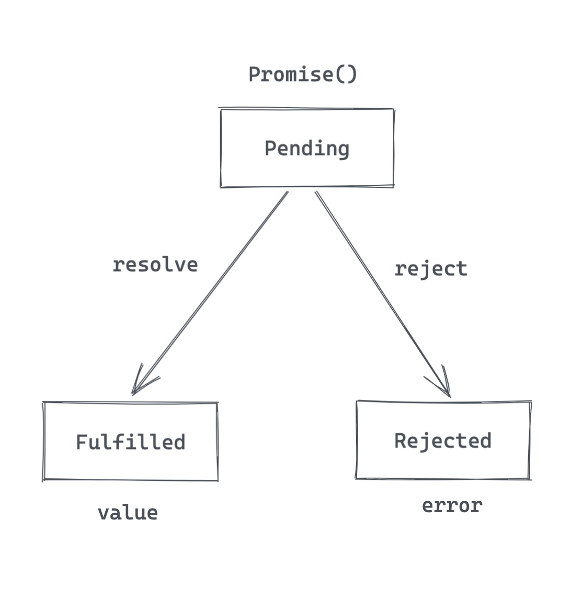

### Promise

```js
function timer(ms) {
    return new Promise(
      (resolve) => setTimeout(resolve, ms)
    );
}

timer(200)
.then(() => timer(100))
.then(() => timer(50))
.then(() => console.log("I'm the last one"));
```

### Async/Await

```js
async function run() {
    await timer(200);
    await timer(100);
    await timer(50);
    console.log("I'm the last one");
}
  ```

---

### The Rust approach

---

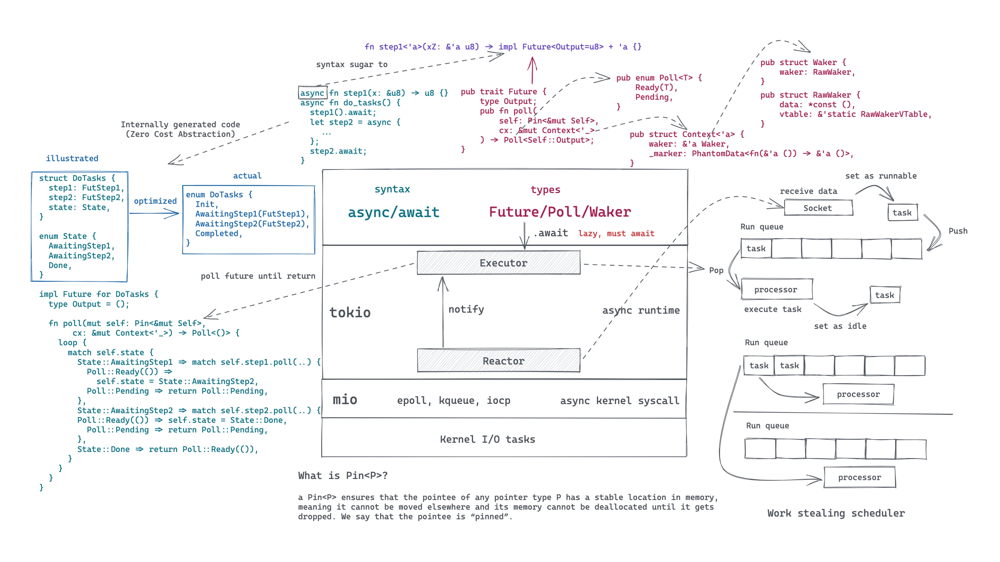

---

### Live coding: kv store

---

### One more thing...

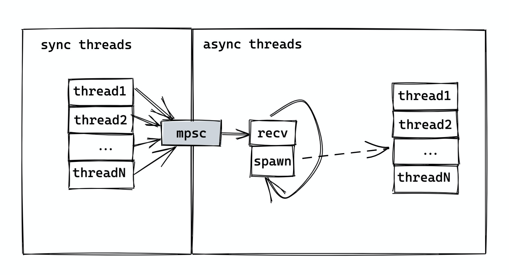

---

### Event store 例子

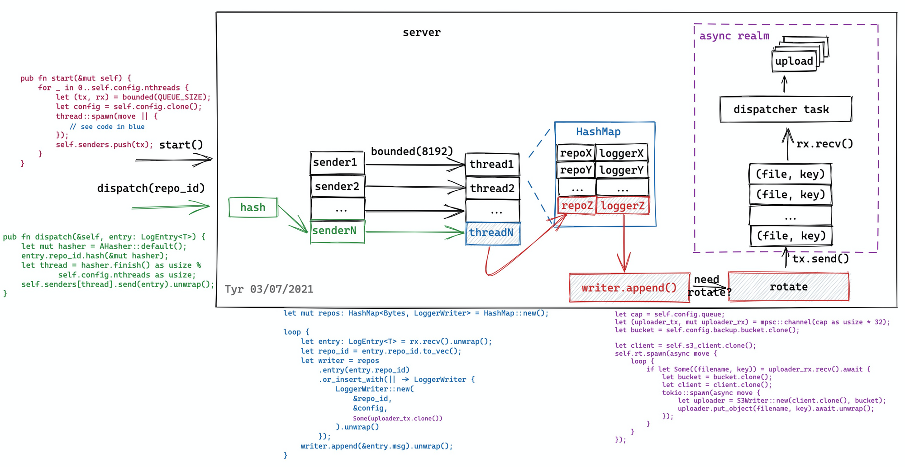

---

## 参考文档

- [Future explained](https://cfsamson.github.io/books-futures-explained)
- [Rust async book](https://rust-lang.github.io/async-book)
- [calloop: a callback based event loop](https://github.com/Smithay/calloop)


---

## Networking and security

---

### Network Stack


---

### App for centralized network


---


### App for p2p network

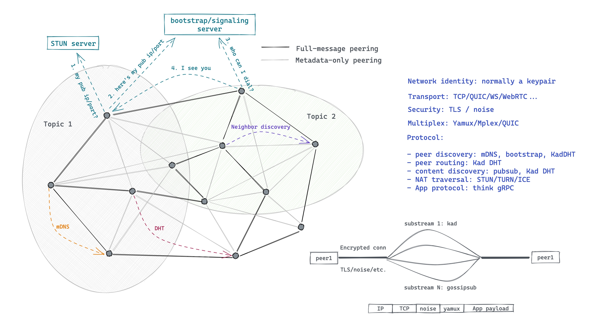

---

### Rust Network Stacks

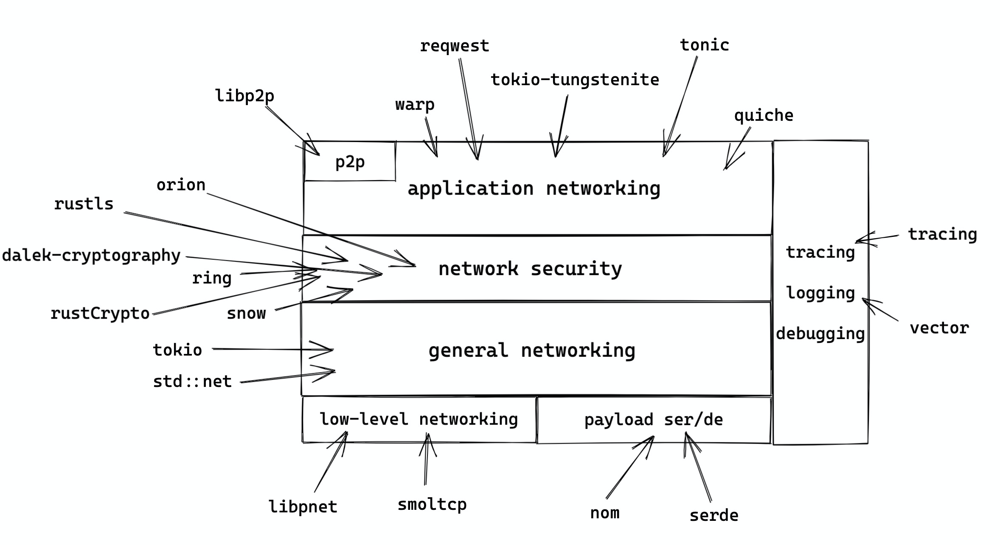

---

### Demo: Build a TCP server (sync/async)

deps: stdlib / tokio

---

### Demo: HTTP Client/Server

deps: reqwest / actix-web

---

### Demo: gRPC

deps: prost / tonic

---

### Steps to write a server

- data serialization: serde / protobuf / flatbuffer / capnp / etc.
- transport protocol: tcp / http / websocket / quic / etc.
- security layer: TLS / noise protocol / secio / etc.
- application layer: your own application logic

---

### Network Security

---

### TLS (skip)

---

### Noise Protocol


---

### Demo for noise protocol

---


### References

- [GRPC Protocol](https://github.com/grpc/grpc/blob/master/doc/PROTOCOL-HTTP2.md)
- [Are we web yet?](https://www.arewewebyet.org/)
- [Tonic: rust grpc framework](https://github.com/hyperium/tonic)

---


<!-- _backgroundColor: #264653 -->
<!-- _color: #e1e1e1 -->

## FFI with C/Elixir/Swift/Java

---

<!-- _backgroundColor: #264653 -->
<!-- _color: #e1e1e1 -->

## WASM/WASI

---

<!-- _backgroundColor: #264653 -->
<!-- _color: #e1e1e1 -->

## Rust for real-world problems

---

<!-- _backgroundColor: black -->
<!-- _color: lightgrey -->

## May the _Rust_ be with you
