<style>
.row {
  display: flex;
  flex-direction: row;
  flex-wrap: wrap;
  width: 100%;
}

.column {
  display: flex;
  flex-direction: column;
  flex-basis: 100%;
  flex: 1;
}
</style>

# Rust Trainings All in One

<style scoped>
    ul { columns: 2; width: 90%; }
</style>

- [High-level intro about Rust](#2)
- [Ownership, borrow check, and lifetime](#35)
- [Typesystem and Generic Programming](#59)
- [Concurrency - primitives](#83)
- Concurrency - async/await
- Networking and security
- FFI with C/Elixir/Swift/Java
- WASM/WASI
- Rust for real-world problems

---

<!-- _backgroundColor: #264653 -->
<!-- _color: #e1e1e1 -->

## High-level Intro About Rust

---

## Why Rust?

---

### Let's talk about values and tradeoffs first

<style scoped>
    ul { columns: 3; width: 90%; }
</style>

- Approachability
- Availability
- Compatibility
- Composability
- Debuggability
- Expressiveness
- Extensibility
- Interoerability
- Integrity
- Maintainabiity
- Measurability
- Operability
- Performance
- Portability
- Productivity
- Resilliency
- Rigor
- Safety
- Security
- Simplicity
- Stability
- Thoroughness
- Transparent
- Velocity

---

## C

<style scoped>
    ul { columns: 3; width: 90%; color: #ddd; }
</style>

- Approachability
- Availability
- Compatibility
- Composability
- Debuggability
- Expressiveness
- Extensibility
- Interoerability
- Integrity
- Maintainabiity
- Measurability
- Operability
- _Performance_
- Portability
- Productivity
- Resilliency
- Rigor
- Safety
- Security
- _Simplicity_
- Stability
- Thoroughness
- _Transparent_
- Velocity
---

## Erlang/Elixir

<style scoped>
    ul { columns: 3; width: 90%; color: #ddd; }
</style>

- Approachability
- Availability
- Compatibility
- Composability
- Debuggability
- Expressiveness
- Extensibility
- Interoerability
- Integrity
- Maintainabiity
- Measurability
- Operability
- Performance
- Portability
- __Productivity__
- _Resilliency_
- Rigor
- _Safety_
- Security
- _Simplicity_
- Stability
- Thoroughness
- Transparent
- Velocity

---

## Python

<style scoped>
    ul { columns: 3; width: 90%; color: #ddd; }
</style>

- _Approachability_
- Availability
- Compatibility
- Composability
- Debuggability
- _Expressiveness_
- Extensibility
- Interoerability
- Integrity
- Maintainabiity
- Measurability
- Operability
- Performance
- Portability
- _Productivity_
- Resilliency
- Rigor
- Safety
- Security
- _Simplicity_
- Stability
- Thoroughness
- Transparent
- Velocity

---

## Java (in early days)

<style scoped>
    ul { columns: 3; width: 90%; color: #ddd; }
</style>

- Approachability
- Availability
- Compatibility
- Composability
- Debuggability
- Expressiveness
- Extensibility
- Interoerability
- Integrity
- Maintainabiity
- Measurability
- Operability
- _Performance_
- _Portability_
- Productivity
- Resilliency
- Rigor
- _Safety (memory)_
- _Security_
- Simplicity
- Stability
- Thoroughness
- Transparent
- Velocity

---

## Rust


<style scoped>
    ul { columns: 3; width: 90%; color: #ddd; }
</style>

- Approachability
- Availability
- Compatibility
- Composability
- Debuggability
- _Expressiveness_
- Extensibility
- Interoerability
- Integrity
- Maintainabiity
- Measurability
- Operability
- _Performance_
- Portability
- _Productivity_
- Resilliency
- Rigor
- _Safety!!!_
- Security
- Simplicity
- Stability
- Thoroughness
- Transparent
- Velocity


---


---

## Why safety is important?

---

<!-- _backgroundColor: #f8f8f8 -->

<style scoped>
h6 {font-size: 16px;}
</style>


###### (Source: [Memory Safety Issues Are Still the Leading Source of Security Vulnerabilities](https://blogs.grammatech.com/memory-safety-issues-are-still-the-leading-source-of-security-vulnerabilities))

---

## Safety is hard!

- memory safety is not easy (you need to understand the corner cases)
- conccurency safety is really hard (without certain tradeoffs)
- Often you have to bear the extra layer of abstractions
  - normally it means performance hit

---

## Memory safety

- Manually - C/C++: painful and error-prone
- Smart Pointers - C++/ObjC/Swift: be aware of cyclical references
- GC - Java/DotNet/Erlang: mubch bigger memory consumption, and STW
- Ownership - Rust: learning curve

---

## Concurrency safety

- single-threaded - Javascript: cannot leverage multicore
- GIL - Python/Ruby: multithreading is notorious inefficient
- Actor model - Erlang/Akka: at the cost of memory copy and heap allocation
- CSP - Golang: at the cost of memory copy and heap allocation
- Ownership + Type System - Rust: super _elegant_ and _no extra cost_!

---

#### How Rust achieves

### _memory and conccurency safety_

#### without extra cost?

---


---

## Show me the code!
---

<!-- _backgroundColor: #1e1e1e -->
<!-- _color: #e1e1e1 -->


---

<!-- _backgroundColor: #1e1e1e -->
<!-- _color: #e1e1e1 -->


---


## Recap

<style scoped>
h5 {font-size: 20px; margin-top: 0px;}
h6 {font-size: 18px; margin-top: 40px;}
</style>

- One and only one owner
- Multiple immutable references
- mutable reference is mutual exclsive
- Reference cannot outlive owner
- _use type safety for thread safety_

###### With these simple rules, Rust achieved safety with
##### __zero cost abstraction__

---

## A glance at Rust Type System


---

## How's Productivity of Rust?

---

<!-- _backgroundColor: #1e1e1e -->
<!-- _color: #e1e1e1 -->


---

## Things built with Rust


---

## Should I use Rust?

- Rust is ideal when you need a system that reliable and performant
- Sometimes you don't, sometimes you do, sometimes you need that later
- it's all about tradeoffs

---

## Rust for our use cases

- parts of the system that are bottlenecks
  - bottleneck on computation
  - bottleneck on memory consumption
  - bootleneck on I/O
- parser/decoder/encoder
- wants to leverage existingC/C++/Rust ecosystem (e.g. you need blake3 for hashing)

---

## Rust FFI

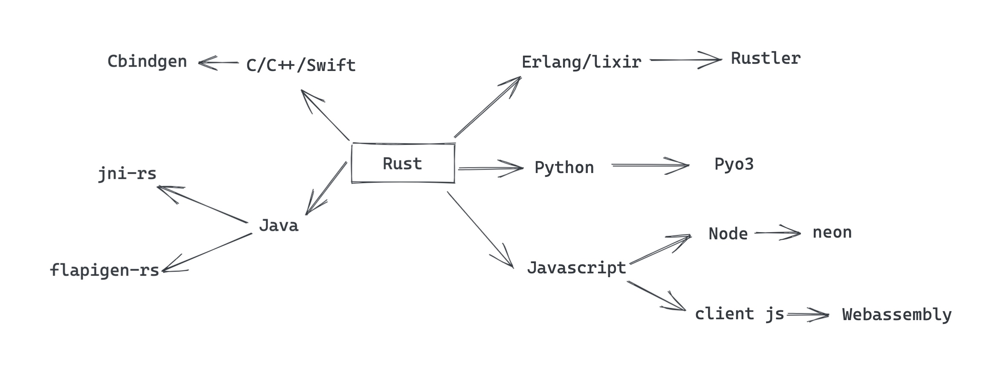

---

## Learning rust as a(n)...

- Elixir eng: ownership model, type system, oh no mutation
- Scala eng: ownership model, oh no mutation
- Typescript eng: ownership model, multi-threaded programming
- Swift/Java eng: ownership model
- Python eng: ownership model, type system

---

## The common misunderstandings

---

### 1. Rust is super hard to learn...

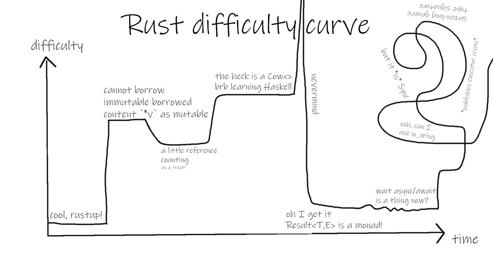

---

### Rust is explicit

- Lots of knowledge about computer science is suddenly explicit to you
- If all your pain to learn a lang is 100%:
  - Rust:
    - Compiler help to reduce that to 90%
    - Then you suffer 70% the pains in first 3-6 months
    - Then the rest 20% in 3-5 years
  - Other:
    - You suffer 10-30% in first 3-6 months
    - Then 70%-90% in next 3-5 years
---

### 2. Unsafe Rust is evil...


---

<style scoped>
    ul { columns: 2; width: 90%; color: #ddd; }
</style>

## References

- [The pain of real linear types in Rust](https://gankra.github.io/blah/linear-rust/)
- [Substructural type system](https://en.wikipedia.org/wiki/Substructural_type_system)
- [Rust official book](https://doc.rust-lang.org/book/)
- [Rust official site](https://www.rust-lang.org/)
- [Awesome Rust](https://github.com/rust-unofficial/awesome-rust)
- [Are we web yet?](https://www.arewewebyet.org/)
- [Are we async yet?](https://areweasyncyet.rs/)
- [Are we gui yet?](https://www.areweguiyet.com/)
- [Are we learning yet?](http://www.arewelearningyet.com/)
- [Are we game yet?](https://arewegameyet.rs/)
- [Are we quantum yet?](https://arewequantumyet.github.io/)
- [Are we IDE yet?](https://areweideyet.com/)
- [Rust is for Professionals](https://gregoryszorc.com/blog/2021/04/13/rust-is-for-professionals/)

---

<!-- _backgroundColor: #264653 -->
<!-- _color: #e1e1e1 -->

## Ownership, borrow check, and lifetime

---

### Ownership/Borrow Rules Review


---

## Lifetime, not a new idea

---

#### Lifetime: Stack memory

```c
#include <stdio.h>
static int VALUE = 42;

void world(char *st, int num) {
    printf("%s(%d)\n", st, num);
}


void hello(int num) {
    char *st = "hello world";
    int v = VALUE+num;
    world(st, v);
}

int main() {
    hello(2);
}

```

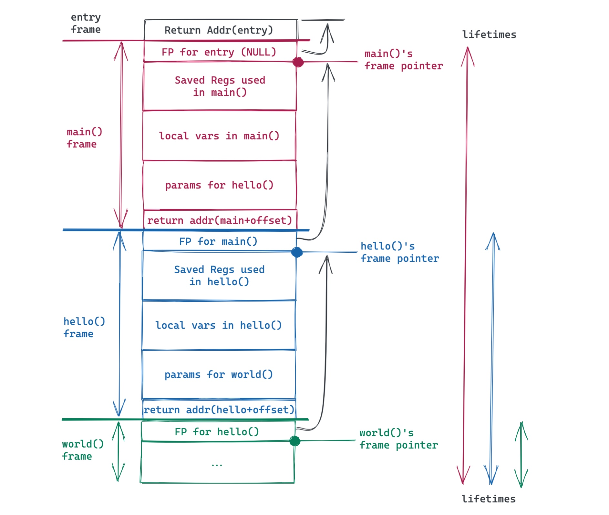

---

#### Lifetime: Heap memory (tracing GC)

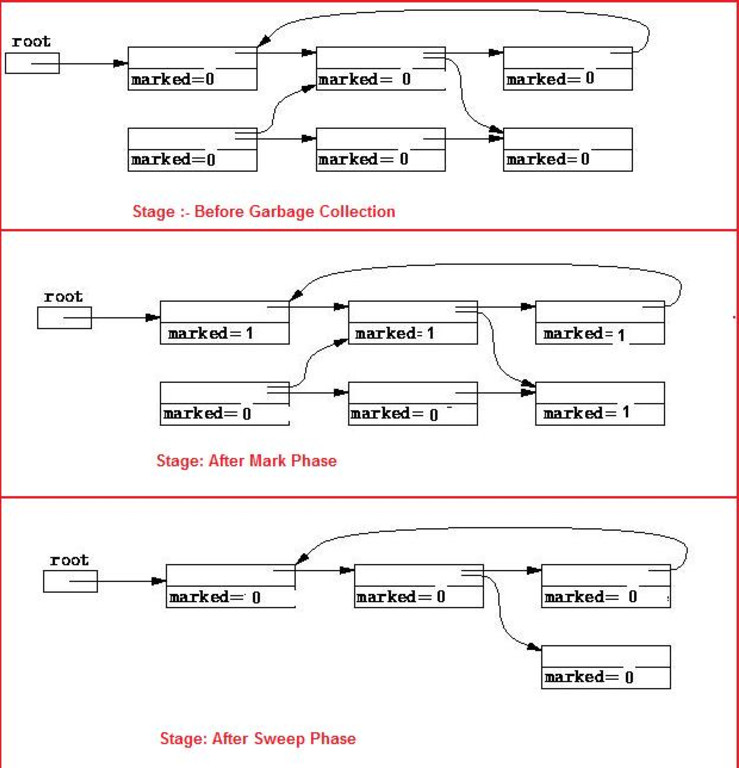

---

#### Lifetime: Heap memory (ARC)


---

## How Rust handles lifetime?

---

### Move semantics

---


---

### What a bout Borrow?

Think about: why does this work in Rust, but not C/C++?

---


---

#### Rust lifetime checker prevents this...


---

### Benefit of lifetime-constrained borrow

- can borrow anything (stack object, heap object)
- safety can be guaranteed at compile-time (no runtime lifetime bookkeeping)
- Rust borrow checker is mostly a lifetime checker

---

### Lifetime Annotation

- similar as generics, but in lowercase starting with `'`
- only need to put annotation when there's conflicts

```rust
// need explicit lifetime
struct User<'a> {
    name: &'a str,
    ...
}
fn process<T, 'a, 'b>(item1: &'a T, item2: &'b T) {}

// &'a User could be written as &User since on confliction
fn lifetime_example(user: &User) { // --+ Lifetime 'a
    if user.is_authed() {          //   |--+ Lifetime 'b
        let role = user.roles();   //   |  |
                                   //   |  |--+ Lifetime 'c
        verify(&role);             //   |  |  |
                                   //   |  |--+
    }                              //   |--+
}                                  // --+

fn verify(x: &Role) { /*...*/ }
```

---

### Static Lifetime

- 'static
- data included in bss / data / text section
  - constants / static variables
  - string literals
  - functions
- if used as trait bound:
  - the type does not contain any non-static references
  - owned data always passes a `'static` lifetime bound, but reference to the owned data does not

---

## Thread spawn

<style scoped>
    p { font-size: 24px; }
</style>

```rust
pub fn spawn<F, T>(f: F) -> JoinHandle<T>
where
    F: FnOnce() -> T,
    F: Send + 'static,
    T: Send + 'static,
{
    Builder::new().spawn(f).expect("failed to spawn thread")
}
```

The 'static constraint is a way of saying, roughly, that no borrowed data is permitted in the closure.

---

### RAII (Resource Acquisition Is Initialization)

- initializing the object will also make sure resource is initialized
- releasing the object will also make sure resource is released

---

### Drop Trait

- memory
- file
- socket
- lock
- any other OS resources

---

## demo

---


---

## Mental model

- write the code and defer the complexity about ensuring the code is safe/correct
- comfront the most of the safety/correctness problems upfront
- Mutate can only happen when you own the data, or you have a mutable reference
  - either way, the thread is guaranteed to be the only one with access at a time
- Fearless Refactoring
- reinforce properties well-behaved software exhibits
- sometimes too strict: rust isn't dogmatic about enforcing it

---

## References

- [Mark-And-Sweep (Garbage Collection Algorithm)](https://www.linkedin.com/pulse/mark-and-sweep-garbage-collection-algorithm-saral-saxena/)
- [Tracing garbage collection](https://en.wikipedia.org/wiki/Tracing_garbage_collection)
- [Swift: Avoiding Memory Leaks by Examples](https://medium.com/hackernoon/swift-avoiding-memory-leaks-by-examples-f901883d96e5)
- [Reference counting](https://en.wikipedia.org/wiki/Reference_counting)
- [Fearless concurrency with Rust](https://blog.rust-lang.org/2015/04/10/Fearless-Concurrency.html)
- [Rust means never having to close a socket](https://blog.skylight.io/rust-means-never-having-to-close-a-socket/)
- [Programming Rust: ownership](https://www.oreilly.com/library/view/programming-rust/9781491927274/ch04.html)
- [Crust of Rust: lifetime annotation (recommended)](https://www.youtube.com/watch?v=rAl-9HwD858)

---

## Cost of defects

- Don't introduce defect (this is impossible because humans are fallible).
- Detect and correct defect as soon as the bad key press occurs (within reason: you don't want the programmer to lose too much flow) (milliseconds later).
- At next build / test time (seconds or minutes later).
- When code is shared with others (maybe you push a branch and CI tells you something is wrong) (minutes to days later).
- During code review (minutes to days later).
- When code is integrated (e.g. merged) (minutes to days later).
- When code is deployed (minutes to days or even months later).
- When a bug is reported long after the code has been deployed (weeks to years later).

---

## Ownership and Borrow rules

- Use after free: no more (reference can't point to dropped value)
- Buffer underruns, overflows, illegal memory access: no more (reference must be valid and point to owned value)
- memory level data races: no more (single writer or multiple readers)

---

<!-- _backgroundColor: #264653 -->
<!-- _color: #e1e1e1 -->

## Typesystem and Generic Programming

---


---

### How types are layed out in memory?

---


---

## Trait (Typeclass)

---


---

### Trait Object

- Unlike java, you can't assign a value to a trait (no implicit reference!!!)
- trait object is a fat pointer (automatically converted)
  - normal pointer reference to the value
  - vtable (vtable pointer)
    - unlike C++/Java, it is not a ptr in struct
- dynamic dispatch


---

<!-- _backgroundColor: #1e1e1e -->
<!-- _color: #e1e1e1 -->


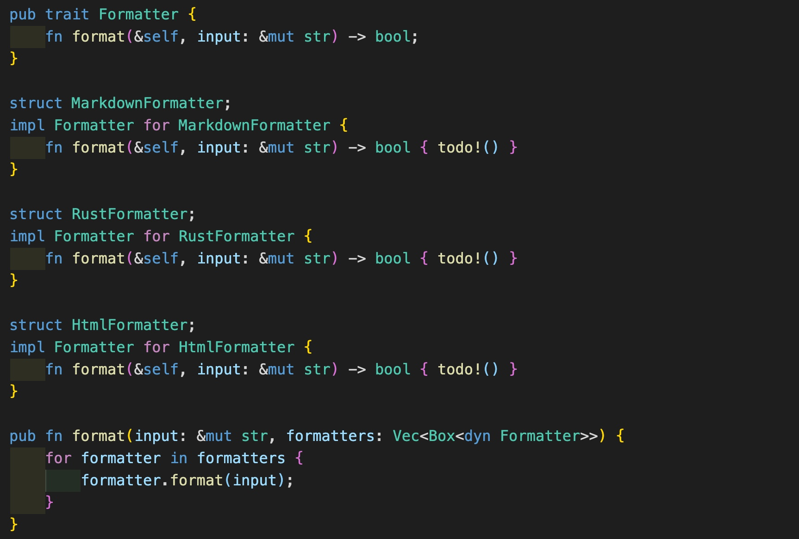

---

#### More about trait

- associated type
- generics
- supertrait
- trait composition


---

## Generics

---

### History of Generic Programming


(from: [Fundamentals of Generic Programming](http://stepanovpapers.com/DeSt98.pdf))

---

### Classification of Abstractions

- _Data Abstractions_: data types and sets of operations defined on them
  - e.g. `Vec<T>`, `HashMap<K, V>`
- _Algorithmic abstrations_: families of data abstractions that have a set of efficient algorithms in common (generic algorithms)
  - e.g. `quicksort`, `binary_search`
- _Structural abstractions_: a data abstraction A belongs to a structural abstraction S if and only if S is an intersection of some of the algorithmic abstractions to which A belongs.
  - e.g. singly-linked-lists
- _Representational abstractions_: mappings from one structural abstration to another, creating a new type and implementing a set of operations on that type.
  - e.g. `VecDeque<T>`
- Comes from: Generic Programming: http://stepanovpapers.com/genprog.pdf

---

### _Generics_ to __Types__

just like
###  _Types_ to __Values__


---

<!-- _backgroundColor: #000 -->
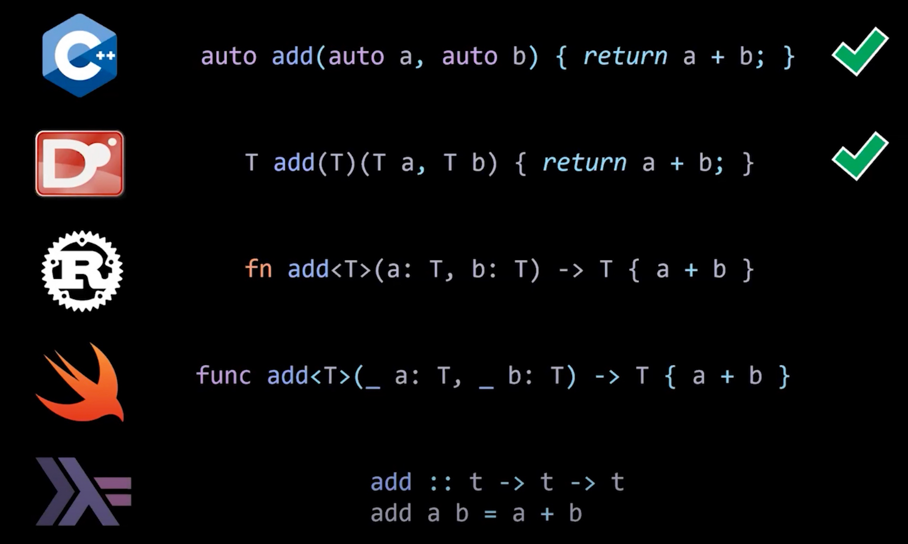

---

<!-- _backgroundColor: #000 -->


---

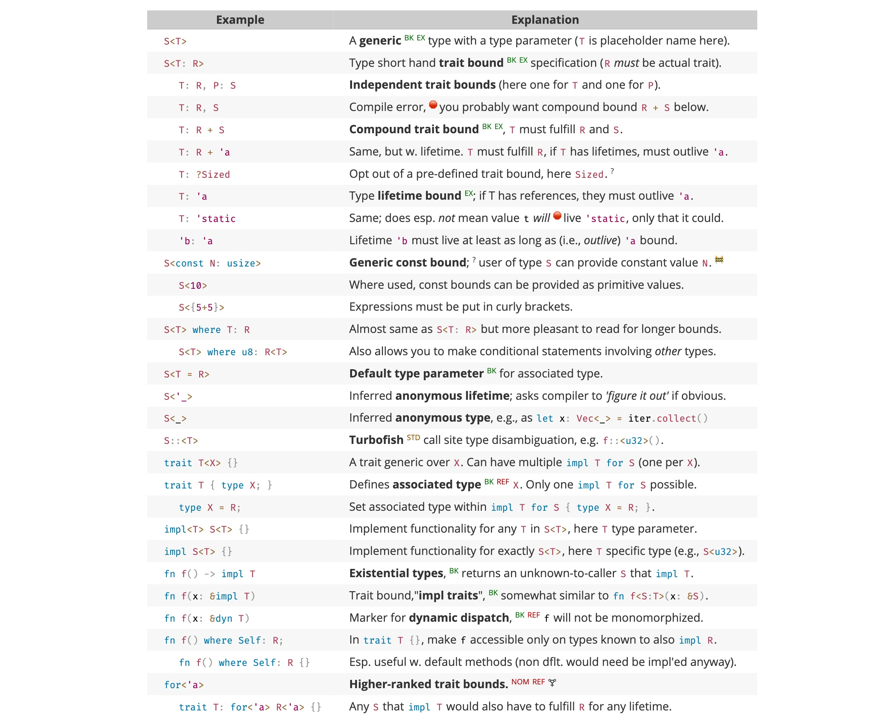

---

### Generic Programming Example


demo: [rust implmentation](https://github.com/tyrchen/rust-training/blob/master/code/gp/src/lib.rs)

---

## Realworld GP example

---

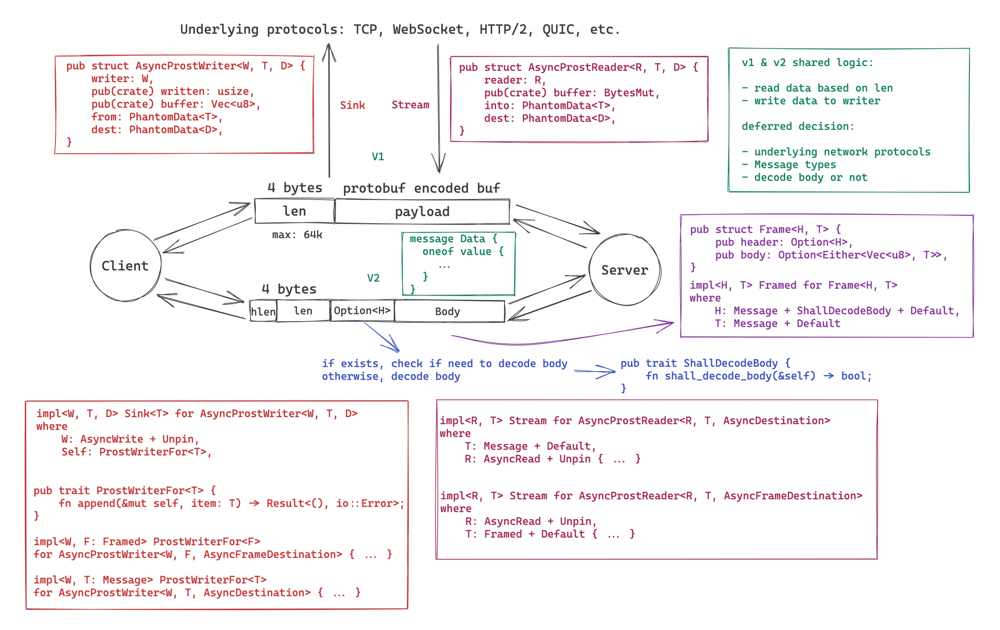

---

> Functions delay binding: data structures induce binding.
> Moral: Structure data late in the programming process.
>
> — Epigrams on programming
---

## References


- [All about trait objects](https://brson.github.io/rust-anthology/1/all-about-trait-objects.html)
- [Protocol-oriented programming in swift](https://www.youtube.com/watch?v=xE5EcHuz52I&ab_channel=ThuyLuongThi)
- [Generic Data Types](https://doc.rust-lang.org/book/ch10-01-syntax.html)
- [Generics (Rust by Example)](https://doc.rust-lang.org/beta/rust-by-example/generics.html)

---

## Why not object oriented?

---

### Class is awesome

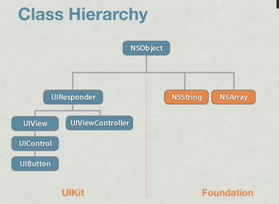

- Encapsulation
- Access control
- Abstraction
- Namespace
- Extensibility

---

### Class has problems

- inheritance is pretty limited - choose superclass well!
- know what/how to override (and when not to)
- superclass may have properties
  - you have to accept it
  - initialization burden
  - don't break assumptions of superclass
- hard to reuse outside the hierachy (composition over inheritance)

---

## Concurrency - primitives

---

## Let's solve a real-world problem

---

### v1: Simple loop

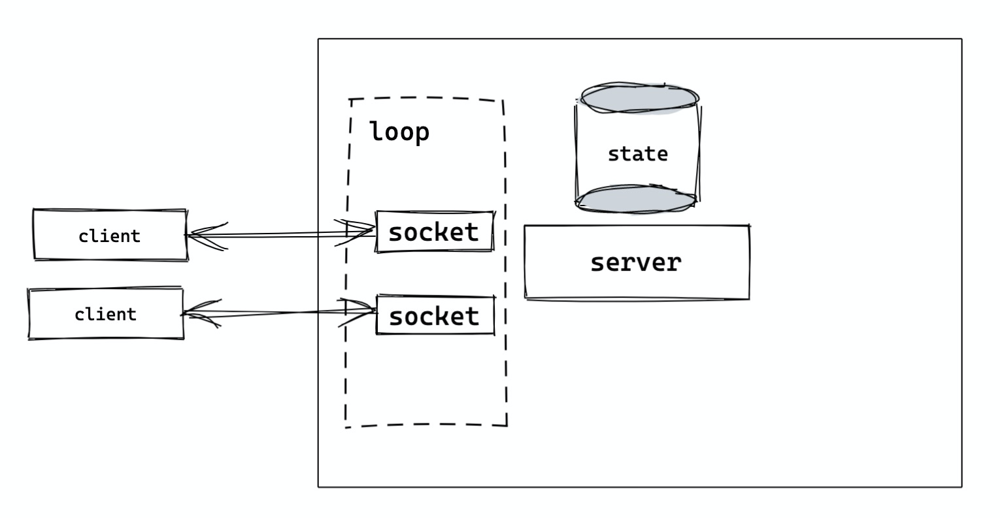

---

### v2: Multithread with shared state

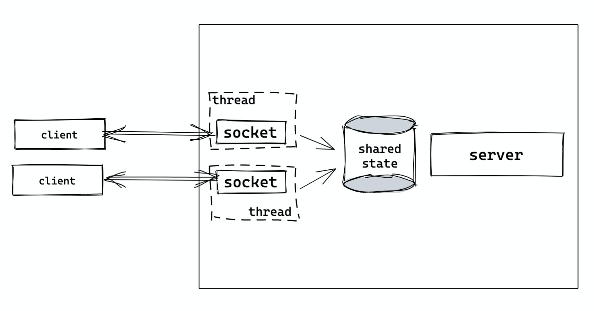

---

### v3: Optimize the lock

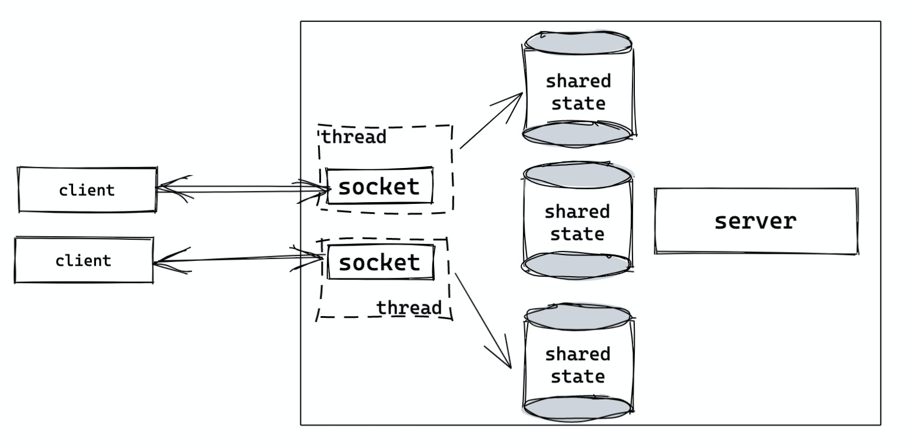

---

### v4: Share memory by conmmunicating

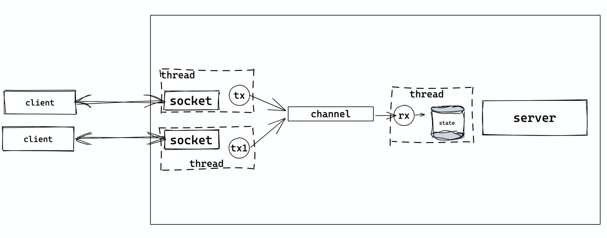

---

### v5: Async Task


---

## What have we used so far?

- Mutex Lock
- Channel/Actor
- Async Task (coroutine, promise, etc.)

---

## How is Mutex implemented?

---

### An naive implementation

```Rust
struct Lock<T> {
  locked: bool,
  data: T,
}

impl<T> Lock<T> {
  pub fn new(data: T) -> Lock<T> { ... }

  pub fn lock<R>(&mut self, op: impl FnOnce(&mut T) -> R) -> R {
    // spin if we can't get lock
    while self.locked != false {} // **1
    // ha, we can lock and do our job
    self.locked = true; // **2
    // execute the op as we got lock
    let ret = op(self.data); // **3
    // unlock
    self.locked = false; // **4
    ret
  }
}

// You may call it like this:
let l = Lock::new(0);
l.lock(|v| v += 1);
```

---

### Issues

- Atomicity
  - In multicore environment, race condition between 1 and 2 - other thread may kick in
  - Even in single core environment, OS may do preempted multitasking, causing other thread kick in
- OOO execution
  - Compiler might generate optimized instructions that put 3 before 1
  - CPU may do OOO execution to best utilize pipeline, so putting 3 before 1 might also happen

---

### How to solve this?

- We need CPU instruction to guarantee Atomicity and non-OOO
- Algorithm: _CAS (Compare-And-Swap)_
- data structure: `AtomicXXX`

---

## Atomics

---

### Updated lock

```Rust
struct Lock<T> {
  locked: AtomicBool, // ***
  data: UnsafeCell<T>, // ***
}
unsafe impl<T> Sync for Lock<T> where T: Send {} // need to explicitly impl `Send`

impl<T> Lock<T> {
  pub fn new(data: T) -> Self { ... }
  pub fn lock<R>(&mut self, op: impl FnOnce(&mut T) -> R) -> R {
    // spin if we can't get lock
    while self
      .locked
      .compare_exchange(false, true, Ordering::Acquire, Ordering::Relaxed)
      .is_error() {}
    // execute the op as we got lock
    let ret = op(unsafe { &mut *self.v.get() }); // **3
    // unlock
    self.locked.store(false, Ordering::Release); // **4
    ret
  }
}

// You may call it like this:
let l = Lock::new(0);
l.lock(|v| v += 1);
```

---

### What does ordering mean?

- Relaxed: No restriction to compiler/CPU, OOO is allowed
- Release:
  - for current thread, any read/write inst cannot be OOO after this inst (`store`);
  - for other thread, if they use `Acquire` to read, they would see the changed value
- Acquire
  - for current thread, any read/write inst cannot be OOO before this inst (`compare_exchange`)
  - for other thread, if they use `Release` to update data, the modification would be see for current thread
- AcqRel: combination of Acquire and Release
- SeqCst: besides `AcqRel`, all threads would see same operation order.

---

### Optimization

```Rust

pub struct Lock<T> {
    locked: AtomicBool,
    data: UnsafeCell<T>,
}
unsafe impl<T> Sync for Lock<T> where T: Send {}

impl<T> Lock<T> {
  pub fn new(data: T) -> Self {...}
  pub fn lock<R>(&self, op: impl FnOnce(&mut T) -> R) -> R {
      while self
          .locked
          .compare_exchange(false, true, Ordering::Acquire, Ordering::Relaxed)
          .is_err()
      {
          while self.locked.load(Ordering::Relaxed) == true {
              std::thread::yield_now(); // we may yield thread now
          }
      }
      let ret = op(unsafe { &mut *self.data.get() });
      self.locked.store(false, Ordering::Release);
      ret
  }
}
```

---


---

#### This is basically how

## Mutex

#### works

---

### Real world Mutex


---

## Semaphore

---

> In computer science, a _semaphore_ is a variable or abstract data type used to control access to a common resource by multiple processes and avoid critical section problems in a concurrent system such as a multitasking operating system. A trivial semaphore is a plain variable that is changed (for example, incremented or decremented, or toggled) depending on programmer-defined conditions.
>
> A useful way to think of a semaphore as used in a real-world system is as __a record of how many units of a particular resource are available__, coupled with operations to adjust that record safely (i.e., to avoid race conditions) as units are acquired or become free, and, if necessary, wait until a unit of the resource becomes available.

---

### Semaphore as a generalized Mutex


---

### Demo code: restricted HTTP client

[code/primitives/src/http_semaphore.rs](https://github.com/tyrchen/rust-training/blob/master/code/primitives/src/http_semaphore.rs)

---

## Channel

---

### Channel basics

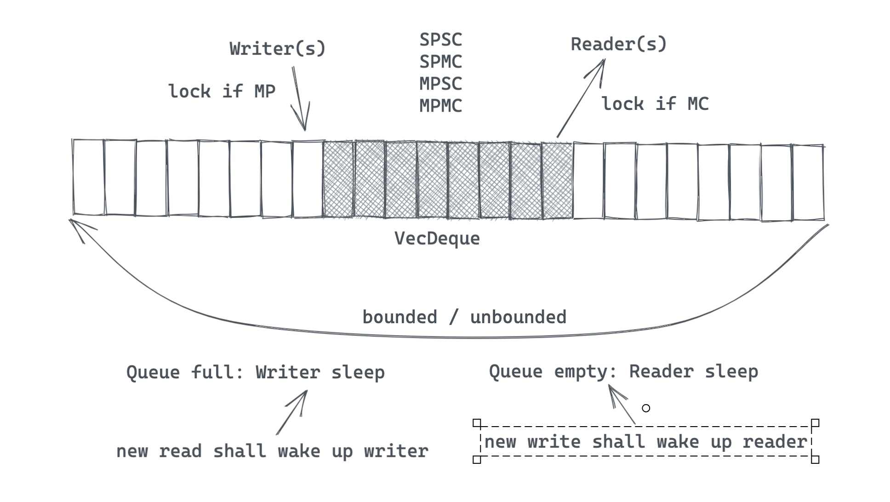

---

### Flavours of Channels

- sync: sender can block, limited capacity
  - `Mutex` + `Condvar` + `VecDeque`
  - Atomic VecDeque (atomic queue) + `thread::park` + `thread::notify`
- async: sender cannot block, unbounded
  - `Mutex` + `Condvar` + `VecDeque`
  - `Mutex` + `Condvar` + `DoubleLinkedList`
- rendezvous: sync with capacity = 0. Used for thread sync.
  - `Mutex` + `Condvar`
- oneshot: only one call to `send()`. e.g. Ctrl+C to stop all threads
  - atomic swap
- async/await
  - basically same as sync but waker is different

---

### Demo code: naive MPSC

[code/primitives/src/channel.rs](https://github.com/tyrchen/rust-training/blob/master/code/primitives/src/channel.rs)

---

### Demo code: naive actor

- Questions:
  - Which type of channel shall we use? SPSC, SPMC, MPSC?
  - When creating an actor, what is its `pid`?
  - When sending a message to an actor, how the actor reply (`handle_call`)?
- Code: [code/primitives/src/actor.rs](https://github.com/tyrchen/rust-training/blob/master/code/primitives/src/actor.rs)

---

## References

- CAS: https://en.wikipedia.org/wiki/Compare-and-swap
- Ordering: https://doc.rust-lang.org/std/sync/atomic/enum.Ordering.html
- std::memory_order: https://en.cppreference.com/w/cpp/atomic/memory_order
- Atomics and Memory Ordering: https://www.youtube.com/watch?v=rMGWeSjctlY
- spinlock: https://en.wikipedia.org/wiki/Spinlock
- spin-rs: https://github.com/mvdnes/spin-rs
- parking lot：https://github.com/Amanieu/parking_lot
- Flume: https://github.com/zesterer/flume
- Crossbeam channel：https://docs.rs/crossbeam-channel

---

### Things to do with atomics

- lock free data structure
- in memory metrics
- id generation

---


<!-- _backgroundColor: #264653 -->
<!-- _color: #e1e1e1 -->

## Concurrency - async/await

---

<!-- _backgroundColor: #264653 -->
<!-- _color: #e1e1e1 -->

## Networking and security

---

<!-- _backgroundColor: #264653 -->
<!-- _color: #e1e1e1 -->

## FFI with C/Elixir/Swift/Java

---

<!-- _backgroundColor: #264653 -->
<!-- _color: #e1e1e1 -->

## WASM/WASI

---

<!-- _backgroundColor: #264653 -->
<!-- _color: #e1e1e1 -->

## Rust for real-world problems

---

<!-- _backgroundColor: black -->
<!-- _color: lightgrey -->

## May the _Rust_ be with you
